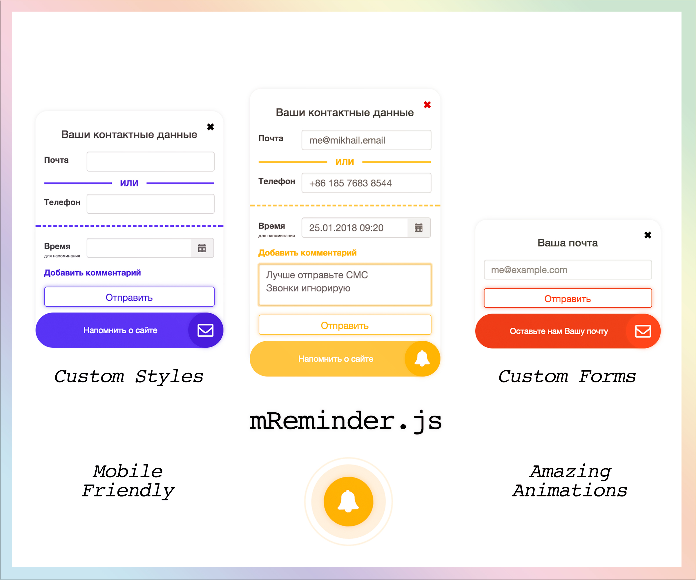

# mReminder.js
Add reminder to your page


## Installation
### [Bower](http://bower.io)
```
bower install mReminder.js
```

## Examples
1. Default: [click](https://mikelarg.github.io/mReminder.js/examples/default/index.html) :neckbeard:
2. Custom Styles Example: [click](https://mikelarg.github.io/mReminder.js/examples/style/index.html) :godmode:
3. Custom Form Example: [click](https://mikelarg.github.io/mReminder.js/examples/mail/index.html) :eyes:

## Options:
* zIndex — z-index of reminder. Default: ```999```
* reminderAnimation — show reminder animation? Default: ```true```
### Icons
* icons — class of icons to show in reminder. Default: ```["bell-alt", "commenting-o", "mail"]```
* selectedIcon — first class of icon to show. Default: ```"bell-alt"```
### Titles
* reminderText — bottom reminder message. Default: ```"Напомнить о сайте"```
### Delays
* activeDelay — delay before reminder will open. Default: ```200```
* reInitDelay — delay to reinit reminder if window rescale. Default: ```600```
* iconDelay — delay before icon in reminder change. Default: ```2500```
* reminderAnimationDelay — delay before animation (expanding circle and border around reminder) will be start. Default: ```3000```
### Proportions
* reminderIconSize — reminder size (width and height). Default: ```60```
* reminderFullSize — form height (max-height). Default: ```320```
* position — reminder position in the window. Can be in percent and in px. Default: ```{bottom: '10%', right: '10%'}```
* formBorderRadius — form border radius. Default: ```20```
* mobileWidth — width of screen when reminder will transform to mobile version. Default: ```425```
* mobileHeight — height of screen when reminder will transform to mobile version. Default: ```500```
### AJAX
* ajaxUrl — where to send data of form? Default: ```""```
* ajaxMethod — ajax method. Default: ```"POST"```
### Callbacks
#### submitCallback
Called when form submit button pushed
**Parameters**:
* mReminder — reminder element
* data — form data

**Return**
true — if form don't have errors, false — if have

**Default**
```js 
function (mReminder, data) {
    var errorContact = mReminder.find('.m-reminder__form-error_contact');
    var timeContact = mReminder.find('.m-reminder__form-error_time');
    var haveErrors = false;
    if (data.email || data.phone) {
        errorContact.removeClass(activeFormErrorClass);
    } else {
        errorContact.addClass(activeFormErrorClass);
        haveErrors = true;
    }
    if (data.time_pc || data.time_mobile) {
        timeContact.removeClass(activeFormErrorClass);
    } else {
        timeContact.addClass(activeFormErrorClass);
        haveErrors = true;
    }
    if (haveErrors) {
        mReminderForm.find('.m-reminder__form-submit button').blur();
    }
    return !haveErrors;
}
```
#### ajaxCallback
Called when ajax have finished
**Parameters**:
* mReminder — reminder element
* data — ajax data

**Return**
true — if you want to reminder close, false — if not

**Default**
```js
function (mReminder, data) {
    mReminder.find('.m-reminder__form input').each(function () {
        jQuery(this).val("");
    });
    return true;
}
```
#### onInitForm
**Parameters**:
* mReminderForm — reminder form element

**Default**
```js
function (mReminderForm) {
    mReminderForm.find('.input-group.date').datetimepicker({
        locale: 'ru'
    });
    var textArea = mReminderForm.find('.m-reminder__form-text-area');
    mReminderForm.find('.m-reminder__form-text-area-label').on("click touchdown", function () {
        if (!textArea.hasClass(activeTextAreaClass)) {
            textArea.fadeIn(300);
            textArea.addClass(activeTextAreaClass);
        }
    });
    textArea.textareaAutoSize();
    textArea.on('keyup', function () {
        textArea.focus();
    });
}
```
### Templates
#### form
Reminder form template
**Default**
```html
<div class='m-reminder__form-close'>✖</div>
<h4 class='text-center m-reminder__form-title'>Ваши контактные данные</h4>
<div class='form-group row col-xs-12 m-reminder__form-group'>
    <label class='col-xs-3 m-reminder__form-label'>Почта</label>"   
    <input type='email' class='col-xs-9 m-reminder__form-input' name='email'>
</div>
<div class='row col-xs-12 m-reminder__form-separator'>
    <div class='col-xs-5 m-no-padding m-reminder__form-separator-line m-reminder__form-separator-line_left'></div>
    <div class='col-xs-2 m-no-padding m-reminder__form-separator-text'>ИЛИ</div>" +
    <div class='col-xs-5 m-no-padding m-reminder__form-separator-line m-reminder__form-separator-line_right'></div>
</div>
<div class='form-group row col-xs-12 m-reminder__form-group'>
    <label class='col-xs-3 m-reminder__form-label'>Телефон</label>
    <input type='email' class='col-xs-9 m-reminder__form-input' name='phone'>
</div>
<div class='col-xs-12 m-reminder__form-error m-reminder__form-error_contact'>Введите Ваш телефон или почту!</div>
<div class='row  m-reminder__form-separator_full'>
    <div class='col-xs-12 m-no-padding m-reminder__form-separator-line m-reminder__form-separator-line_dashed'></div>
</div>
<div class='form-group row col-xs-12 m-reminder__form-group m-reminder__form-group_time hidden-xs'>
    <label class='col-xs-3 m-reminder__form-label m-reminder__form-label-time'>Время</label>
    <div class='input-group date col-xs-9'>
        <input type='text' name='time_pc' class='m-reminder__form-input col-xs-12' />
        <span class='input-group-addon'>"
            <span class='glyphicon glyphicon-calendar'></span>
        </span>
    </div>
</div>
<div class='form-group row col-xs-12 m-reminder__form-group m-reminder__form-group_time visible-xs'>
    <label class='col-xs-3 m-reminder__form-label m-reminder__form-label-time'>Время</label>
    <input type='datetime-local' name='time_mobile' class='m-reminder__form-input col-xs-9' />
</div>
<div class='col-xs-12 m-reminder__form-error m-reminder__form-error_time'>Введите время напоминания!</div>
<div class='form-group row col-xs-12 m-reminder__form-group m-reminder__form-group_last'>
    <label class='col-xs-12 m-reminder__form-label m-reminder__form-text-area-label'>Добавить комментарий</label>
    <textarea class='m-reminder__form-input m-reminder__form-text-area col-xs-12' name='comment' rows='1' wrap='soft' maxlength='140'></textarea>
</div>
<div class='form-group row col-xs-12 m-reminder__form-submit'>
    <button class='form-control col-xs-12 m-reminder__form-input'>Отправить</button>
</div>
```
